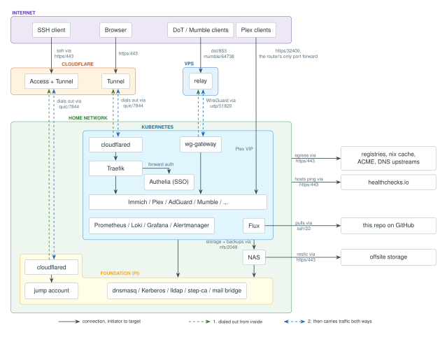

# nixos-config

NixOS homelab consisting of five hosts, a Flux-reconciled Kubernetes cluster. It
began years ago as a single docker-compose file on the NAS that would not have
been easy to recover. Also, the security part was lacking with plain Docker
secrets and lots of port forwarding on the router. The current state has been
built since April 2026.

This is an anonymized snapshot of a private repository where every important
value was replaced with placeholders. The history is intentionally a single
commit because the real history would leak things I deem private. Development
happens in the private repo and this copy is refreshed from time to time so
there will never be a blindingly green contribution graph here, sorry recruiters
;-).

## Architecture

### Everything as code

Everything that can be done via IaC is done so. Things that can be derived are
generated. The remaining exceptions to this creed are a few manual steps that
are documented. This enables a fast and clear strategy for recovery and it keeps
the project easy to work on with AI because the knowledge is codified and
greppable instead of strewn across GUIs.



### Hardware

Three x86 NUCs form the Kubernetes cluster, a Raspberry Pi 5 is the foundation
host, the NAS holds bulk storage and backup targets, and a free-tier cloud VPS
is used as a public edge node to hide the home IP address.

### Foundational host

Everything the cluster depends on but that must never depend on the cluster: DNS
(dnsmasq), the Kerberos KDC, LDAP (lldap), the internal CA (step-ca) and a
Proton mail bridge.

### Kubernetes cluster

Highly available control plane on all three nodes (etcd, keepalived API VIP)
with Cilium as the CNI acting as a kube-proxy replacement and L2 VIP
announcement. Longhorn is used for replicated block storage. Flux is employed
for GitOps, so that the cluster reconciles itself from this repo, and stray
edits by hand are reverted automatically.

### Public entry

The home IP does not appear in public DNS records and the web traffic never
touches the VPS because a connector inside the cluster dials out to Cloudflare
and the public hostnames go through that tunnel straight to the cluster ingress.
The VPS relays what Cloudflare Tunnel cannot carry: DNS-over-TLS and Mumble
terminate there and are forwarded over a WireGuard link that the cluster also
dials out to the VPS. Cloudflare Spectrum could carry those too and make the
relay unnecessary, but but this project aims to only use free resources or cheap
ones where this is not possible. SSH runs through two more tunnels behind
Cloudflare Access, one on the VPS for the VPS itself and one at home ending in a
restricted jump account. Every path is dialed out from the inside (the dashed
tunnel pairs in the diagram). Only Plex has a port forwarded in the router.

### Services

Immich (photo backup), Mumble (voice chat, a self-hosted Discord alternative),
AdGuard Home (LAN-wide DNS blocking, also serving DoT/DoH to the outside), and
Plex with Plexamp in front of a CD collection ripped to the NAS.

### Monitoring

Prometheus collects metrics and Loki collects logs from every host and every
pod. Both feed Grafana and Alertmanager. Alerting works from two directions.
From the inside, Alertmanager mails on Prometheus rules. From the outside, every
critical job pings healthchecks.io, the edge node probes the public endpoints
end to end, and a dead-man switch fires when the alerting pipeline itself goes
quiet. If a check on healthchecks.io is down an email is also sent. This is to
make sure that something that is done is actively reported.

### Identity and PKI

One user database (lldap) feeds SSH logins, SSO (Authelia) and the NAS; NFS is
Kerberos-authenticated end to end. step-ca is the single root of trust issuing
the Kubernetes control-plane certificates, service certificates on the hosts,
and in-cluster certificates via ACME. The repo carries the root certificate and
every trust store is generated from it. A daily check alerts if the live CA ever
diverges from the committed copy. CA rotation is an executable app, instead of a
flimsy runbook. The PKI is strictly internal, so only the fleet trusts the
private root and public endpoints need publicly trusted certificates instead.
They sit on a real registered domain with a Terraform-managed DNS zone and
certificate renewal is automated wherever possible.

### Secrets

Two YubiKeys as well as one offline age key function as a security boundary.
Host secrets are agenix-encrypted (hosts decrypt with their SSH host keys) while
in-cluster secrets are SOPS-encrypted and decrypted by Flux at apply time. CI
assert are used to prevent leaking of secrets to git. Encrypted-in-git is a
deliberate choice over running a secret manager because for example a Hashicorp
vault would be one more service that has to be up and unsealed before anything
else can start, while git plus a YubiKey works from a cold start.

### Backups

Nightly application-consistent database dumps, etcd snapshots and Longhorn
volume backups land on the NAS. The files landing on the NAS are snapshotted and
pushed offsite via restic, everything age-encrypted to the YubiKeys and the
offline key. A daily audit verifies every expected artifact by name.

### Operations

cluster.json is the single source of truth for every shared value. A generator
splices it into all consumers and CI fails on drift. Hosts patch themselves
weekly (kured drains and reboots cluster nodes), watchdogs self-heal broken
network interfaces, and every host reports the git revision it runs so partial
deploys are detected. RESTORE.md is the runbook to rebuild the cluster in case
of a disaster, and a drill app compares backups byte-for-byte against live
hosts.

- `cluster.json` - every shared value (addresses, VIPs, CIDRs, keys, devices,
  healthchecks). `nix run .#regenerate-manifests` splices it into everything
  that consumes it.
- `flake.nix` - hosts and the `nix run .#<app>` tooling; each app documents its
  usage in its header.

Deploy one host or the fleet:

```bash
nix run .#deploy -- <host>|--all
```

## Next steps

- the network outside the cluster is still clickops (router and switch); an
  upgrade would be something IaC-managed, ubiquiti maybe
- RTL8159 10G RJ45 NICs: smaller, less heat, potentially better kernel support
- a smart power strip to powercycle components remotely
- replace the synology NAS with a custom box running nix
- HA for the foundation host: a second rpi running the same services in
  parallel. Needs lldap swapped for openldap (syncrepl) since lldap cannot
  replicate, a replica KDC for Kerberos, both DNS servers handed to clients, and
  a shared database backend for step-ca, the one service where HA means more
  than a second instance
- some kind of VM based test system checking the restore runbook works? maybe
  that would lend itself well to automation and lead to an automated restore
  procedure instead of a runbook
